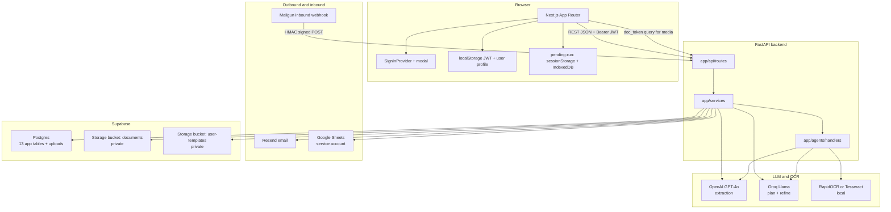
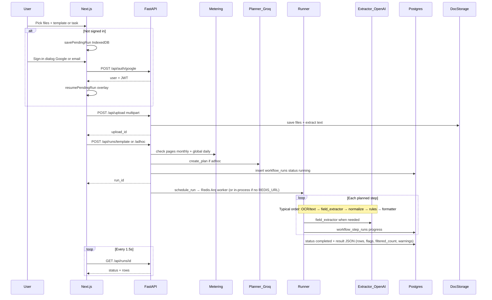
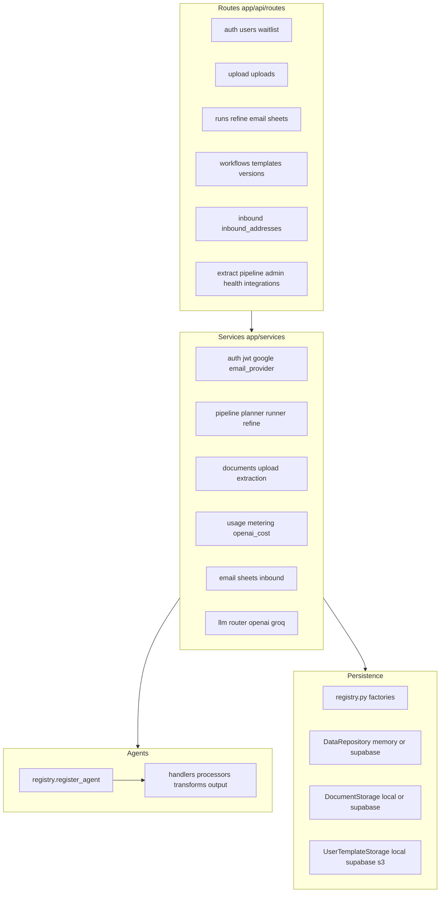
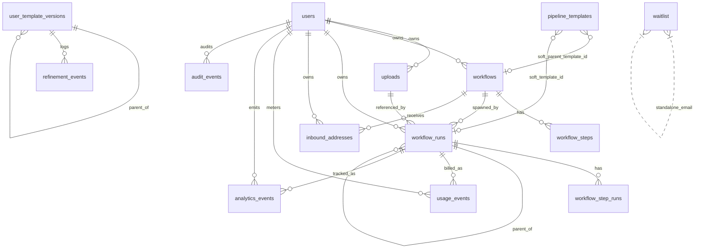
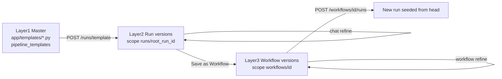
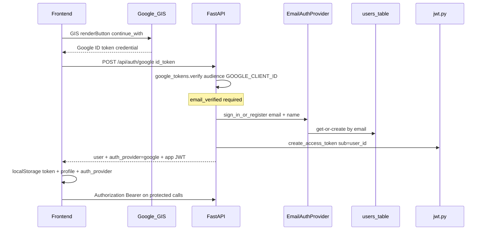
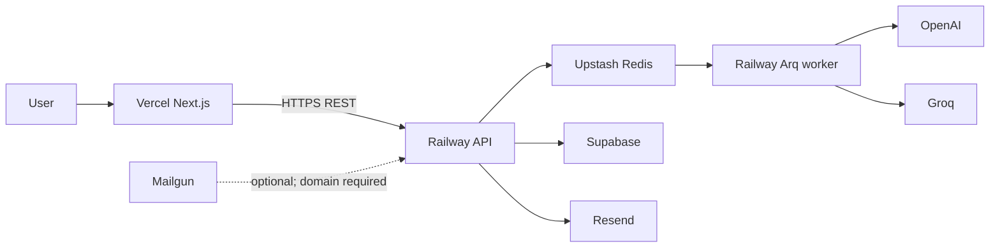

# Nexora — System Architecture (Study Guide)

**Interview-ready source of truth** for how this product works: data model, auth, storage, APIs, keys, and the code to open when explaining a flow.

| | |
|---|---|
| **Product** | Nexora — upload documents, describe a task (or pick a template), run an AI agent pipeline, get structured rows, refine via chat, optionally save as a reusable workflow |
| **Stack** | Next.js (App Router) ↔ FastAPI ↔ Groq (plan/refine) + OpenAI GPT-4o (extract) + RapidOCR/Tesseract ↔ Supabase Postgres + Storage |
| **Repos** | [`backend/`](./backend/), [`frontend/`](./frontend/) |
| **Related** | Product/API detail: [SPEC.md](./docs/SPEC.md) · Engineering rules: [ENGINEERING-PRINCIPLES.md](./docs/ENGINEERING-PRINCIPLES.md) · Next work: [NEXT-STEPS.md](./docs/NEXT-STEPS.md) |
| **Last updated** | 2026-08-24 |

---

## Table of contents

1. [Elevator pitch & mental model](#1-elevator-pitch--mental-model)
2. [System context diagram](#2-system-context-diagram)
3. [Request lifecycle (happy path)](#3-request-lifecycle-happy-path)
4. [Backend layers & agent registry](#4-backend-layers--agent-registry)
5. [Database — ER & table catalog](#5-database--er--table-catalog)
6. [Storage model & three-layer templates](#6-storage-model--three-layer-templates)
7. [Auth & authorization](#7-auth--authorization) — providers, session JWT, `doc_token`, ownership
8. [Metering, caps & rate limits](#8-metering-caps--rate-limits)
9. [Integrations](#9-integrations)
10. [Keys & config cheat sheet](#10-keys--config-cheat-sheet)
11. [Frontend map](#11-frontend-map)
12. [Open this file when…](#12-open-this-file-when)
13. [Interview FAQ](#13-interview-faq)
14. [Deployment sketch](#14-deployment-sketch)

---

## 1. Elevator pitch & mental model

**What it does:** A user uploads PDFs/images (invoices, receipts, resumes, etc.), picks a **template** or writes a plain-English **task**. The backend **plans** a short agent pipeline (OCR/text → LLM field extract → **deterministic normalize** → rules → format), **runs** it asynchronously, and the UI **polls** until structured rows appear. The user can **refine** extraction in chat (creates a versioned child run), **save as a workflow** for reuse, and optionally deliver via **email** or **Google Sheets**. **Inbound email** (Mailgun → `flow-…@` workflow address) is **built** (HMAC webhook + Workflow Settings UI) but **ops-off** on the CV deploy until we own a receiving domain.

**One-line architecture:**

> Browser (Next.js + JWT) → FastAPI routes → services → registered agent handlers → Groq/OpenAI/OCR → Supabase Postgres (metadata) + object storage (files & version payloads).

**Auth gate (important product decision):**

- **Public:** browse template catalog, health, integrations status, waitlist, sign-in endpoints.
- **Protected:** upload, run, refine, workflows, usage, document access — require **app JWT** (or a short-lived **doc capability token** for media ``/`<iframe>`).
- Unsigned users can select files + template on home; hitting Run opens a **centered sign-in dialog** (Google GIS **button**, not One Tap). After sign-in, pending docs resume automatically (blur overlay → results page). No anonymous LLM spend → metering and telemetry always attach to a `user_id`.
- **Not in codebase:** Supabase Auth on the client, passwords, magic links, or OAuth beyond Google ID-token verify.

**LLM split (cost/quality):**

| Task | Provider | Why |
|------|----------|-----|
| Field extraction | **OpenAI GPT-4o** (+ mini fallback) | Highest quality structured JSON / schema adherence |
| Planner, refine chat, pipeline refiner | **Groq** (Llama 3.3 etc.) | Fast + cheaper for planning / chat |

---

## 2. System context diagram



---

## 3. Request lifecycle (happy path)

### 3.1 End-to-end sequence



### 3.2 Stage cheat sheet

| Stage | HTTP | Backend | Notes |
|-------|------|---------|-------|
| Sign-in | `POST /api/auth/google` or `/api/auth/session` | `auth.py`, `google_tokens.py`, `jwt.py` | Returns `{ user, token, is_new_user, auth_provider }` |
| Upload | `POST /api/upload` | `UploadService.process_upload_batch` | Text/OCR at **upload** time; max 10 files; `MAX_PAGES_PER_FILE`; registry row in `uploads` |
| Doc media | `POST .../documents/{id}/access` then `GET ...?doc_token=` | `jwt.create_document_access_token` | Short-lived capability token for ``/`<iframe>` |
| Plan | inside adhoc / `POST /api/pipeline/create` | `planner.create_plan` | Groq + agent catalog; after extract always insert **normalize** before rules/formatter |
| Template plan | `/api/runs/template` | `template_planner.create_plan_from_template` | Code templates; always inserts `transform.normalize` between extract and rules |
| Start run | `/api/runs/*` | `start_run` + `schedule_run` (Arq) | Check pages → start → **reserve** pages; refund on fail |
| Execute | background | `runner.execute_run` | Handlers via `get_handler`; `ctx.data` carries `user_id`/`run_id` for outbound agents |
| Poll | `GET /api/runs/{id}` | ownership check | Frontend `useRunPolling` @ **1500ms** |
| Refine plan | `POST .../refine/plan` | `refine_chat.plan_refinement` | Cap check → clarify; `in_scope=false` refuses; ready → page charge then GPT-4o preview |
| Refine apply | `POST .../refine` | `RefineService.refine_and_start` | Cap + **page reserve before** Groq; child run + `parent_run_id`; format fixes prefer normalize; ADD RULE supports flag/filter/set |
| Save workflow | `POST /api/workflows/from-run/...` | WorkflowService | Copies plan for reuse |

### 3.3 Pending-run resume (unsigned → signed)

1. User selects files/template on home, clicks Run → `ensureUser()` throws `SignInRequiredError`.
2. Frontend `savePendingRun({ kind, files, templateId, task })`:
   - **Metadata** → `sessionStorage` key `nexora_pending_run`
   - **File bytes** → IndexedDB DB `nexora_pending_run`
3. `SignInProvider` opens modal (no navigation to `/account`).
4. On success: if `hasPendingRun()`, show **ProcessingOverlay**, `resumePendingRun()` uploads + starts run, `router.push(/results/{run_id})`.
5. If no pending intent (nav Sign in only): close modal, **stay on current page**.

Key files: `frontend/src/lib/pending-run.ts`, `frontend/src/lib/resume-pending-run.ts`, `frontend/src/hooks/use-sign-in.tsx`.

---

## 4. Backend layers & agent registry

Follows [ENGINEERING-PRINCIPLES.md](./docs/ENGINEERING-PRINCIPLES.md): **routes → services → persistence → domain**. Routes must not talk to Supabase/disk directly.



| Layer | Directory | Responsibility |
|-------|-----------|----------------|
| Routes | `backend/app/api/routes/` | HTTP, DI, status codes, map to API models |
| Dependencies | `backend/app/api/dependencies.py` | `CurrentUserDep`, repo injection |
| Ownership | `backend/app/api/ownership.py` | `require_self`, `require_workflow_owner`, `require_upload_owner`, `get_owned_upload`, `require_run_access` |
| Services | `backend/app/services/` | Business logic |
| Agents | `backend/app/agents/` | One step = one handler |
| Persistence | `backend/app/persistence/` | Protocols + backends |
| Domain | `backend/app/models/domain/` | Dataclasses |
| API models | `backend/app/models/api/` | Pydantic schemas |
| Config | `backend/app/config.py` | All settings from env |

### Registered agents

Bootstrap: `import app.agents.handlers` in `main.py` lifespan registers all handlers.

| `agent_type` | Handler path | Role | Uses LLM? |
|--------------|--------------|------|-----------|
| `processor.text_extract` | `handlers/processors/text_extract.py` | Digital PDF text (PyMuPDF / Docling) | No |
| `processor.ocr` | `handlers/processors/ocr.py` | Scanned PDF/images (RapidOCR default) | No |
| `transform.field_extractor` | `handlers/transforms/field_extractor.py` | Structured fields via OpenAI | **Yes** |
| `transform.normalize` | `handlers/transforms/normalize.py` | Deterministic date/amount/currency/phone cleanup (`normalize_values.py`) | No |
| `transform.rules` | `handlers/transforms/rules.py` | Row actions: **flag** (default), **filter**, **set**; ops gt/contains/exists/… | No |
| `transform.pipeline_refiner` | `handlers/transforms/pipeline_refiner.py` | Refine-time plan/prompt rewrite (Groq) | **Yes** |
| `output.formatter` | `handlers/output/formatter.py` | Shape CSV/JSON/table; includes `filtered_count` | No |
| `output.email` | `handlers/output/email_agent.py` | In-pipeline Resend; **reserves** monthly email units | No (HTTP) |
| `output.google_sheets` | `handlers/output/sheets_agent.py` | In-pipeline Sheets; **reserves** monthly Sheets units | No (HTTP) |

Registry API: `register_agent`, `get_handler`, `get_agent_catalog` in `app/agents/core/registry.py`. Planner reads the catalog to choose steps.

**Post-extract transforms (authoring paths):**

| Path | Normalize | Rules |
|------|-----------|-------|
| Template | Always inserted after field_extractor | From template `rules` JSON (omit `action` → flag) |
| Adhoc task | Planner instructed to insert after extract | Planner builds rules from natural language |
| Refine chat | Refiner ensures normalize exists for format fixes | ADD RULE with `action: flag \| filter \| set` |

Scalar row fields only — nested `transactions[]` rules are deferred ([SCALING-AND-JOBS.md](./docs/SCALING-AND-JOBS.md)). Validators (`services/extraction/validators.py`) still **warn** without rewriting values; normalize is the rewrite step.

### App entry

`backend/app/main.py`:

- Lifespan: seed pipeline templates, import handlers
- Middleware: SlowAPI rate limits, CORS
- Mounts all routers under `/api/...`

---

## 5. Database — ER & table catalog

**Source of truth:** [`backend/supabase/schema.sql`](./backend/supabase/schema.sql) for fresh installs + incremental [`backend/supabase/migrations/`](./backend/supabase/migrations/) (`001`–`017`) for existing DBs.

**Footnote — schema drift:** column `workflow_runs.transient_refinement` exists in migration `006` but is not in `schema.sql`. Prefer migrations when upgrading a live project; sync `schema.sql` when convenient.

### 5.1 ER diagram



Soft links (`parent_template_id`, `template_id`) are **text**, not FKs — master catalog IDs like `invoice` live in code and/or `pipeline_templates`.

### 5.2 Table catalog

#### `users`
| | |
|---|---|
| **Purpose** | App identity (**not** Supabase Auth users) |
| **PK** | `id` uuid |
| **Columns** | `name`, `email`, `created_at`, `is_admin` |
| **Indexes** | `idx_users_email` |
| **Written by** | Auth sign-in / register (`EmailAuthProvider` upsert by email) |
| **Auth note** | No password hash column — Google proves the email, or local email auth is passwordless when `AUTH_ALLOW_EMAIL=true` |

#### `uploads`
| | |
|---|---|
| **Purpose** | Registry of an upload batch owned by a user (mig `012`) |
| **PK** | `id` (matches storage `upload_id`) |
| **FK** | `user_id` → `users` |
| **Used by** | Upload ownership checks; runs store the same `upload_id` string |

#### `workflows`
| | |
|---|---|
| **Purpose** | Saved reusable pipelines |
| **PK** | `id` |
| **FK** | `user_id` → `users` CASCADE |
| **Notable** | `parent_template_id`, `current_template_version_id`, `extraction_prompt`, `default_email`, `default_sheets_url`, `default_sheet_name`, `task_description`, `source` |
| **Indexes** | `idx_workflows_user_id` |

#### `workflow_steps`
| | |
|---|---|
| **Purpose** | Ordered agent steps for a saved workflow |
| **FK** | `workflow_id` → `workflows` CASCADE |
| **Unique** | `(workflow_id, step_order)` |
| **Columns** | `agent_type`, `config` jsonb, `reason` |

#### `workflow_runs`
| | |
|---|---|
| **Purpose** | One execution (adhoc or workflow-linked) |
| **FK** | `workflow_id` → workflows SET NULL; `user_id` → users SET NULL (`011`); `parent_run_id` → self SET NULL |
| **Notable** | `upload_id`, `document_ids`, `status`, `planned_steps`, `result` (rows, flags, `filtered_count`, confidence, validation_warnings), `template_id`, `current_template_version_id`, `extraction_prompt`, `cached_documents`, `refine_summary`, `transient_refinement` (mig 006) |
| **Statuses** | typically `running` → `completed` \| `failed` |

#### `workflow_step_runs`
| | |
|---|---|
| **Purpose** | Per-step status + output during a run |
| **FK** | `run_id` → `workflow_runs` CASCADE |
| **Unique** | `(run_id, step_order)` |

#### `pipeline_templates`
| | |
|---|---|
| **Purpose** | Master template catalog mirror (also defined in Python `app/templates/`) |
| **PK** | `id` text (e.g. `invoice`) |
| **Notable** | `fields`, `rules`, `suggested_steps`, `extraction_instructions`, `is_active`, `sort_order` |

#### `user_template_versions`
| | |
|---|---|
| **Purpose** | Index of refined template versions; **payload in object storage** |
| **PK** | `id` uuid (app-supplied) |
| **Check** | `scope_type` ∈ `run` \| `workflow` |
| **FK** | `parent_version_id` → self |
| **Unique** | `(scope_type, scope_id, version_number)` |
| **Key** | `storage_key` → blob in `user-templates` bucket |

#### `refinement_events`
| | |
|---|---|
| **Purpose** | Audit of user refine messages |
| **FK** | `version_id` → `user_template_versions` CASCADE |

#### `inbound_addresses`
| | |
|---|---|
| **Purpose** | Per-workflow ingest email (`flow-….@domain`) |
| **PK** | `address_id` |
| **Unique** | `full_address` |
| **FK** | `user_id`, `workflow_id` CASCADE |

#### `usage_events`
| | |
|---|---|
| **Purpose** | Metering: **pages** (extraction pool) and **outbound** units (email/Sheets) |
| **FK** | `user_id` CASCADE; `run_id` SET NULL |
| **Indexes** | `idx_usage_events_user_month (user_id, created_at)` |
| **event_type** | Pages: `extraction`, `refine`, `refine_preview`, `extract_api`, `refund:*`. Outbound: `email_sent`, `sheets_push` (counted separately; **not** in page sum) |
| **pages column** | For outbound rows, `pages` stores **unit count** (usually 1), not document pages |

#### `waitlist`
| | |
|---|---|
| **Purpose** | Pro interest — `source` attribution + optional free-text `feedback` |
| **Unique** | `email` — **no FK** to users |
| **Sources** | `normal`, `pages_exhausted`, `emails_exhausted`, `sheets_exhausted`, `refines_exhausted`, `inbound_email` (legacy `pricing_page` → `normal`) |
| **feedback** | Optional note from pricing form (mig `015`, max 1000 chars) |

#### `analytics_events`
| | |
|---|---|
| **Purpose** | Product analytics (runs, errors, durations) |
| **FK** | `user_id` SET NULL; `run_id` SET NULL |

#### `audit_events`
| | |
|---|---|
| **Purpose** | Who did what (auth, upload, run, refine, workflow, delivery). No document payloads. |
| **FK** | `actor_user_id` SET NULL |

### 5.3 Migration timeline

| # | Adds |
|---|------|
| 001 | `planned_steps` on runs |
| 002 | `users`, workflow ownership, `document_ids` |
| 003 | `pipeline_templates` |
| 004 | Refine lineage + `cached_documents` |
| 005 | `extraction_prompt`, `template_id` |
| 006 | `transient_refinement` |
| 007 | `user_template_versions`, `refinement_events` |
| 008 | `inbound_addresses` |
| 009 | `default_email`, `default_sheets_url` |
| 010 | `usage_events`, `waitlist`, `analytics_events`, `users.is_admin` |
| 011 | `workflow_runs.user_id` + backfill |
| 012 | `uploads` registry |
| 013 | private storage policies |
| 014 | `workflows.default_sheet_name` |
| 015 | `waitlist.feedback` |
| 016 | `audit_events` |
| 017 | RLS enabled on all app tables (no client policies) |

---

## 6. Storage model & three-layer templates

### 6.1 Document files

| Mode | Config | Location |
|------|--------|----------|
| Local | `DOCUMENT_STORAGE=local` or auto without Supabase | `{UPLOAD_DIR}/{upload_id}/{document_id}.ext` + `manifest.json` |
| Supabase | `DOCUMENT_STORAGE=supabase` or auto with keys | Bucket `SUPABASE_DOCUMENTS_BUCKET` (default `documents`) |

**Registry:** Postgres table `uploads` (mig `012`) owns each batch (`id` = `upload_id`, `user_id`). Runs store `upload_id` + `document_ids` jsonb.

**Privacy:** mig `013` sets Storage buckets `documents` and `user-templates` to **private** (`public=false`). The app serves files only through authenticated routes — never public Storage URLs. Browser ``/`iframe` use a short-lived **`doc_token`** (see §7.6).

### 6.2 User template payloads

| Mode | Config | Location |
|------|--------|----------|
| Local | `USER_TEMPLATE_STORAGE=local` | under upload dir `user-templates/` |
| Supabase | `supabase` / auto | Bucket `user-templates` |
| AWS S3 | `aws_s3` | Future swap via `AWS_S3_*` |

Postgres `user_template_versions` holds metadata; full `planned_steps` / prompts live in the blob at `storage_key`.

### 6.3 Three-layer template model

User refinements **never mutate** master Python templates.



| Layer | Canonical store | DB pointer |
|-------|-----------------|------------|
| Master | Python + optional `pipeline_templates` | N/A |
| Run version | `user-templates` key `runs/{root_id}/…` | `workflow_runs.current_template_version_id` |
| Workflow version | `user-templates` key `workflows/{id}/…` | `workflows.current_template_version_id` |

### 6.4 Persistence backends

Selected only in `backend/app/persistence/registry.py`:

| Concern | Env | Backends |
|---------|-----|----------|
| Users / workflows / runs / versions index | `PERSISTENCE_BACKEND` | `auto` → supabase if configured else **memory**; or force `memory` / `supabase` |
| Uploaded files | `DOCUMENT_STORAGE` | `auto` / `local` / `supabase` |
| Version payloads | `USER_TEMPLATE_STORAGE` | `auto` / `local` / `supabase` / `aws_s3` |
| Master templates | same persistence | code registry + optional Supabase mirror |

**Interview line:** “Protocols in `protocols.py`, one registry maps env → implementations so routes never branch on storage.”

---

## 7. Auth & authorization

### 7.1 Model (what we ship)

This app does **not** use Supabase Auth on the client. Supabase is **Postgres + private Storage** via the **service role** on the server. Identity is an app concern:

1. Prove the human (Google ID token, or optional passwordless email in local/tests).
2. Upsert a row in the app `users` table.
3. Issue a short-lived **app JWT** the API owns (`Authorization: Bearer`).
4. For document **media** only, mint a separate short-lived **capability token** (`doc_token`) so ``/`<iframe>` work without putting the session JWT in a query string.



**Interview line:** “Google proves email; we own the session JWT and ownership checks. Supabase never sees the browser as an Auth client.”

### 7.2 Providers & endpoints

| Path | Env gate | Behavior |
|------|----------|----------|
| `POST /api/auth/google` | `GOOGLE_CLIENT_ID` required | Verify GIS ID token (`google.oauth2.id_token.verify_oauth2_token`), upsert user, return JWT. `auth_provider: "google"`. |
| `POST /api/auth/session` | `AUTH_ALLOW_EMAIL=true` | Passwordless email+name → upsert → JWT. `auth_provider: "email"`. **403** when disabled (production). |
| `POST /api/users` | same | Register-only (no JWT). Local/tests; prefer `/auth/session`. |

**Frontend GIS:** `google-sign-in-button.tsx` loads `accounts.google.com/gsi/client`, `initialize` + **`renderButton`** (`continue_with`). **Not** One Tap auto-`prompt`. Client ID: `NEXT_PUBLIC_GOOGLE_CLIENT_ID` (must match backend `GOOGLE_CLIENT_ID`).

**Provider registry:** `backend/app/services/auth/registry.py` — `AUTH_BACKEND=email` → `EmailAuthProvider`. Supabase Auth is a **commented future** stub only (`NEXT-STEPS` defers it).

**Email provider:** `email_provider.py` — normalize email, get-or-create `users` row. **No password hash**, no magic link.

### 7.3 Session JWT

| | |
|--|--|
| Mint / decode | `backend/app/services/auth/jwt.py` |
| Secret | `JWT_SECRET_KEY` (**required** to mint), `JWT_ALGORITHM=HS256`, `JWT_EXPIRY_HOURS=72` |
| Claims | `sub` = **user UUID** (never email), `email`, `iat`, `exp` |
| Transport | `Authorization: Bearer <token>` only for session auth |
| Dependency | `get_current_user` / `CurrentUserDep` in `dependencies.py` — rejects missing/invalid tokens; **rejects** document capability tokens used as session JWTs |

There is **no** custom auth middleware. Routes declare `CurrentUserDep`; SlowAPI uses the same Bearer (or IP) for rate-limit keys.

### 7.4 Document capability tokens (`doc_token`)

`` / `<iframe>` cannot set `Authorization` headers. Session JWTs must **not** be passed as query params.

| Step | Detail |
|------|--------|
| Mint | `POST /api/uploads/{upload_id}/documents/{document_id}/access` — requires Bearer + upload ownership |
| Create | `create_document_access_token` — claims: `sub`, `upload_id`, `document_id`, `purpose="doc"`, `iat`, `exp` |
| TTL | `DOCUMENT_TOKEN_EXPIRY_MINUTES` (default **15**) |
| Fetch | `GET .../documents/{id}?doc_token=...` via `DocumentFileUserDep` — Bearer **or** valid `doc_token` |
| Isolation | Session JWT ≠ doc token (purpose check). Query `access_token` is **not** accepted. |
| FE | `fetchDocumentAccessUrl` in `frontend/src/lib/api.ts` |
| Tests | `test_document_access_tokens.py`, phase1 auth tests |

### 7.5 Public vs protected

| Public (no user JWT) | Protected (JWT / ownership) |
|----------------------|------------------------------|
| `GET /api/health` | `POST /api/upload`, uploads + document access mint |
| `GET /api/integrations` | All `/api/runs/*` (incl. refine) |
| `POST /api/auth/google`, `/api/auth/session`* | `/api/workflows/*`, versions, settings |
| `POST /api/waitlist` | `/api/extract`, `/api/pipeline/create` |
| `GET /api/templates`, `GET /api/templates/{id}` | `/api/inbound-addresses` |
| `POST /api/inbound/email` (Mailgun HMAC) | `/api/users/me`, `/me/usage`, profile PATCH |
| Admin (`X-Admin-Key`) | Manual email/Sheets on a run |

\*Email session + register only if `AUTH_ALLOW_EMAIL=true`. Production keeps it **false**.

### 7.6 Frontend session storage

| Key | Content |
|-----|---------|
| `nexora_access_token` | App JWT (`api.ts`) |
| `nexora_user_id` | uuid |
| `nexora_user_name` | display name |
| `nexora_user_email` | email |
| `nexora_auth_provider` | `google` \| `email` (account copy; set on sign-in) |

Pending-run (unsigned → signed): `sessionStorage` + IndexedDB `nexora_pending_run` (`pending-run.ts`).

On **401** with a sent token: clear session keys, dispatch `nexora:session-expired` → `SignInProvider` opens dialog.

`ensureUser()` (`user-session.ts`): if email auth allowed and no session, may auto-mint `anon-…@local.dev` for local DX; production (email auth off) throws `SignInRequiredError` → modal.

### 7.7 Ownership

`backend/app/api/ownership.py`:

| Helper | Rule |
|--------|------|
| `require_self` | Path `user_id` must match JWT user |
| `require_workflow_owner` | `workflow.user_id` match |
| `require_upload_owner` / `get_owned_upload` | `uploads.user_id` match |
| `require_run_access` | `resolve_run_owner_id`: run.user_id → workflow owner → usage_events fallback |

Cross-user run access → **403**.

### 7.8 Rate-limit identity

`backend/app/rate_limit.py`: Bearer JWT → key `user:{user_id}`, else client IP. Applied to upload + run/refine (and related) via SlowAPI.

### 7.9 Explicitly not implemented

- Supabase Auth (password / magic link / hosted OAuth UI)
- Passwords or refresh-token rotation
- GIS One Tap auto-prompt
- Putting session JWTs in query strings for media

---

## 8. Metering, caps & rate limits

Hard caps (fail-closed). Soft UI warnings (e.g. account amber bar) never allow spend past these gates.

| Cap | Env default | HTTP | Meaning |
|-----|-------------|------|---------|
| Monthly pages / user | `FREE_PAGE_LIMIT_MONTHLY=50` | **429** | Sum of **page** `usage_events` this month |
| Refines / run lineage | `MAX_REFINES_PER_RUN=10` | **429** | Enforced on **plan and apply** |
| Emails / month | `FREE_EMAIL_LIMIT_MONTHLY=20` | **429** | `email_sent` units (HTTP + agents + workflow delivery) |
| Sheets / month | `FREE_SHEETS_LIMIT_MONTHLY=20` | **429** | `sheets_push` units |
| Global pages / day (UTC) | `GLOBAL_DAILY_PAGE_LIMIT=100` | **503** | Cross-user budget brake |
| OpenAI $ / day (est.) | `OPENAI_DAILY_BUDGET_USD=1.0` | fail extract | Token estimate in `openai_cost.py` / `openai_client.py`; `0` disables; **in-process** (single-replica) |
| Pages / file | `MAX_PAGES_PER_FILE=10` | upload reject | Client + server; not the monthly pool |
| Files / upload | hardcoded 10 | 400 | `upload_service` |
| Adhoc/template/refine rate | `RATE_LIMIT_RUNS_ADHOC=10/minute` | 429 slowapi | Abuse throttle |
| Upload rate | `RATE_LIMIT_UPLOAD=20/minute` | 429 slowapi | |
| Refine plan rate | `RATE_LIMIT_REFINE_PLAN` | 429 slowapi | |

**Page flow:** `enforce_upload_usage` (check) → `start_run` → `reserve_page_usage` / `charge_run_pages` (check+record under locks) → on failed execute, `refund_usage_for_run` (negative row).

**Refine:**
- Plan: `check_refine_allowed` first; out-of-scope → `in_scope=false`, **no** GPT-4o preview charge.
- Ready preview / apply: reserve pages **before** expensive LLM; refund on failure.

**Outbound:** `reserve_email_usage` / `reserve_sheets_usage` before Resend/Sheets; agents use `ctx.data.user_id`; workflow defaults skip + log when over cap.

**Summary API:** `GET /api/users/me/usage` → pages + emails + sheets used/limits + `resets_at`.

Code: `metering.py`, `usage_http.py`, `openai_cost.py`. Frontend: `UsageLimitModal` on 429 (no duplicate toast); toast on 503; waitlist `source` from limit message (`waitlist-source.ts`).

---

## 9. Integrations

### Status probe

`GET /api/integrations` (**public**): `email_configured`, `sheets_configured`, `sheets_share_email` (service account `client_email`), `inbound_email_domain`, `inbound_configured` (true when `INBOUND_WEBHOOK_SECRET` is set). Powers Account + Sheets share hint + inbound UI.

### Outbound email (Resend)

- Keys: `RESEND_API_KEY`, `RESEND_FROM_EMAIL`
- Manual: `POST /api/runs/{run_id}/email` — reserve email unit first
- Auto: workflow `default_email` via `deliver_workflow_defaults` after successful run
- Agent: `output.email` — same monthly reserve; needs `user_id` on run context

### Google Sheets

- Key: `GOOGLE_SERVICE_ACCOUNT_JSON` (path or raw JSON)
- Manual: `POST /api/runs/{run_id}/sheets` — reserve Sheets unit first
- Auto: workflow `default_sheets_url` + optional `default_sheet_name` (defaults to `Results`)
- Agent: `output.google_sheets` — same monthly reserve
- **User setup:** share the spreadsheet with the service account `client_email` as **Editor**. UI: `SheetsShareHint` + Workflow Settings + export modal (`GET /api/integrations`).

### Inbound email (Mailgun)

- `INBOUND_EMAIL_DOMAIN` (e.g. `ingest.yourdomain.com`)
- `INBOUND_WEBHOOK_SECRET` — HMAC verify; empty secret rejects webhooks
- **Product:** Workflow Settings create / copy / delete one `flow-…@` address per workflow. Sidebar shows address or “Configure in settings”.
- **Ops (skipped for CV):** Needs MX/TXT on a **domain you control**. The Railway API URL is only the **webhook** Mailgun POSTs to (`https://nexora-api-production-065e.up.railway.app/api/inbound/email`). It cannot be the inbox (`flow-…@….up.railway.app` will not receive mail). See [DEPLOYMENT.md](./docs/DEPLOYMENT.md#mailgun-inbound-setup-one-catch-all-route).
- **Backend:** CRUD `/api/inbound-addresses` + webhook (HMAC → attachments → metered workflow run). Create is idempotent per workflow.
- **Later channel:** WhatsApp inbound is not implemented — [NEXT-STEPS.md](./docs/NEXT-STEPS.md).

### Waitlist

`POST /api/waitlist` — sources in §5.2; frontend `pricingHref` / `waitlistSourceFromLimitMessage`.

---

## 10. Keys & config cheat sheet

**Never put `SUPABASE_SECRET_KEY` or LLM keys in the frontend.** Only `NEXT_PUBLIC_*` is browser-visible.

### Backend (`backend/.env` ← `.env.example`)

| Env var | Purpose | Typical |
|---------|---------|---------|
| `GROQ_API_KEY` | Planner / refine LLM | required for plan/refine |
| `GROQ_MODEL` / `GROQ_REFINER_MODEL` / `GROQ_OWNER_MODEL` | Model IDs | llama-3.3-70b-versatile |
| `GROQ_FALLBACK_MODELS` | Comma-separated fallbacks | listed in example |
| `OPENAI_API_KEY` | Extraction | required for extract quality |
| `OPENAI_MODEL` | Primary extract | `gpt-4o` |
| `OPENAI_FALLBACK_MODELS` | Fallback | `gpt-4o-mini` |
| `JWT_SECRET_KEY` | Sign app JWTs | long random; **required to mint tokens** |
| `JWT_ALGORITHM` | | `HS256` |
| `JWT_EXPIRY_HOURS` | Session JWT TTL | `72` |
| `DOCUMENT_TOKEN_EXPIRY_MINUTES` | Media capability token TTL | `15` |
| `GOOGLE_CLIENT_ID` | Verify GIS ID tokens (audience) | same as frontend public client id |
| `AUTH_ALLOW_EMAIL` | Passwordless email sign-in | `false` in prod |
| `AUTH_BACKEND` | Provider registry | `email` |
| `SUPABASE_URL` | Project URL | |
| `SUPABASE_SECRET_KEY` | Server secret (`sb_secret_…`) | server only |
| `PERSISTENCE_BACKEND` | DB backend | `auto` |
| `DOCUMENT_STORAGE` | File backend | `auto` |
| `SUPABASE_DOCUMENTS_BUCKET` | | `documents` |
| `USER_TEMPLATE_STORAGE` | Version blobs | `auto` |
| `SUPABASE_USER_TEMPLATES_BUCKET` | | `user-templates` |
| `AWS_S3_BUCKET` / `REGION` / `PREFIX` | S3 templates | optional |
| `UPLOAD_DIR` | Local uploads path | `uploads` |
| `MAX_UPLOAD_SIZE_MB` | | `10` |
| `MAX_PAGES_PER_FILE` | | `10` |
| `FREE_PAGE_LIMIT_MONTHLY` | | `50` |
| `FREE_EMAIL_LIMIT_MONTHLY` | Outbound email units | `20` |
| `FREE_SHEETS_LIMIT_MONTHLY` | Outbound Sheets units | `20` |
| `MAX_REFINES_PER_RUN` | | `10` |
| `GLOBAL_DAILY_PAGE_LIMIT` | | `100` |
| `OPENAI_DAILY_BUDGET_USD` | Hard estimated gate | `1.0` (`0` = off) |
| `OCR_ENGINE` | `rapidocr` \| `tesseract` | `rapidocr` |
| `USE_LAYOUT_PRESERVATION` | Docling for digital PDFs | `true` |
| `CORS_ORIGINS` | Comma-separated | `http://localhost:3000` |
| `RATE_LIMIT_RUNS_ADHOC` | slowapi string | `10/minute` |
| `RATE_LIMIT_UPLOAD` | | `20/minute` |
| `RATE_LIMIT_REFINE_PLAN` | | `20/minute` |
| `RESEND_API_KEY` / `RESEND_FROM_EMAIL` | Email | optional |
| `GOOGLE_SERVICE_ACCOUNT_JSON` | Sheets | optional |
| `INBOUND_EMAIL_DOMAIN` | | `ingest.nexora.app` |
| `INBOUND_WEBHOOK_SECRET` | Mailgun signing | required if inbound on |
| `INBOUND_WEBHOOK_MAX_AGE_SECONDS` | Replay window | see config |
| `REDIS_URL` | Arq job queue | empty = in-process local fallback |
| `ORPHAN_RECLAIM_ON_STARTUP` / `ORPHAN_RUN_STALE_MINUTES` | Stuck runs | queue on → stale-only reclaim |
| `ADMIN_API_KEY` | `X-Admin-Key` header | optional |

Hardcoded in settings: `allowed_extensions` = `{.pdf,.png,.jpg,.jpeg}`.

### Frontend (`frontend/.env.local` ← `.env.local.example`)

| Env var | Purpose |
|---------|---------|
| `NEXT_PUBLIC_API_URL` | Backend base (default `http://localhost:8000`) |
| `NEXT_PUBLIC_GOOGLE_CLIENT_ID` | GIS button; must match backend `GOOGLE_CLIENT_ID` |
| `NEXT_PUBLIC_AUTH_ALLOW_EMAIL` | Show email form in sign-in UI |
| `NEXT_PUBLIC_MAX_UPLOAD_SIZE_MB` | Client-side size check (default 10) |
| `NEXT_PUBLIC_MAX_PAGES_PER_FILE` | Client-side page check (default 10; server enforces) |

---

## 11. Frontend map

### Providers (`app/layout.tsx`)

```
UserProvider → SignInProvider → NavBar + page children + Toaster
```

### App Router

```
frontend/src/app/
├── page.tsx                         # Home: upload, templates, run, pending resume
├── account/page.tsx                 # Profile, usage bars, integrations (signed-in)
├── pricing/page.tsx                 # Tiers + waitlist
├── results/[runId]/                # Poll + refine + export (adhoc path)
├── workflows/page.tsx               # List saved workflows
├── workflows/[workflowId]/         # Detail / history / rerun
├── workflows/[workflowId]/settings/
└── workflows/[workflowId]/runs/[runId]/  # Same results UX under workflow
```

### Important client modules

| Module | Role |
|--------|------|
| `lib/api.ts` | Typed fetch, Bearer JWT, `ApiError`, `fetchDocumentAccessUrl`, all endpoints |
| `lib/user-session.ts` | localStorage session (+ `auth_provider`), `ensureUser`, Google/email helpers |
| `lib/pending-run.ts` | Persist mid-run intent across sign-in |
| `lib/resume-pending-run.ts` | Claim + upload + start run |
| `lib/free-plan.ts` | UI constants for free page/email/Sheets limits |
| `lib/waitlist-source.ts` | Waitlist `source` + 429 → attribution |
| `lib/upload-limits.ts` | Client max size/pages (must match backend) |
| `hooks/use-user.tsx` | Shared user for nav badge |
| `hooks/use-sign-in.tsx` | Global modal + processing overlay + resume |
| `hooks/use-run-polling.ts` | Poll every 1.5s while `running` |
| `components/google-sign-in-button.tsx` | GIS `renderButton` |
| `components/modals/sign-in-modal.tsx` | Google + optional email |
| `components/modals/usage-limit-modal.tsx` | Hard-cap 429 UX |
| `components/modals/processing-overlay.tsx` | Blur “Processing your request…” |
| `components/sheets-share-hint.tsx` | Service-account Editor email |
| `components/refine-chat.tsx` | Plan Mode refine UX (`in_scope` / Apply) |
| `components/export-bar.tsx` | Save workflow / email / Sheets (prefills workflow defaults) |

### How a home run starts

1. `ensureUser()` (token or sign-in dialog path)  
2. `uploadFiles(files)` → `upload_id`  
3. `runTemplate(upload_id, templateId)` **or** `runAdhoc(upload_id, task)`  
4. `router.push(/results/{run_id})`  
5. `useRunPolling` until complete  

---

## 12. Open this file when…

| Question | File |
|----------|------|
| App boot, middleware, routers | `backend/app/main.py` |
| All env settings | `backend/app/config.py` |
| Mint / verify session JWT | `backend/app/services/auth/jwt.py` |
| Document capability tokens | `jwt.create_document_access_token` + `uploads` routes |
| Google ID token verify | `backend/app/services/auth/google_tokens.py` |
| Email/passwordless provider | `backend/app/services/auth/email_provider.py` |
| Auth provider registry | `backend/app/services/auth/registry.py` |
| Auth HTTP routes | `backend/app/api/routes/auth.py` |
| Current user dependency | `backend/app/api/dependencies.py` |
| Ownership checks | `backend/app/api/ownership.py` |
| Rate-limit identity | `backend/app/rate_limit.py` |
| Upload + text extract | `backend/app/services/documents/upload_service.py` |
| Planner (Groq) | `backend/app/services/pipeline/planner.py` |
| Background runner | `backend/app/services/pipeline/runner.py` |
| Refine plan (scope) | `backend/app/services/pipeline/refine_chat.py` |
| Refine apply | `backend/app/services/pipeline/refine_service.py` |
| LLM routing OpenAI vs Groq | `backend/app/services/llm/router.py` |
| OpenAI $ budget gate | `backend/app/services/llm/openai_cost.py` |
| Field extraction | `backend/app/services/extraction/field_extractor.py` + agent handler |
| Deterministic normalize | `backend/app/services/extraction/normalize_values.py` + `handlers/transforms/normalize.py` |
| Rules (flag/filter/set) | `backend/app/agents/handlers/transforms/rules.py` |
| Post-extract validators | `backend/app/services/extraction/validators.py` |
| Page + outbound metering | `backend/app/services/usage/metering.py` |
| HTTP usage helpers | `backend/app/api/usage_http.py` |
| Integrations status | `backend/app/api/routes/integrations.py` |
| Persistence switch | `backend/app/persistence/registry.py` |
| Agent register API | `backend/app/agents/core/registry.py` |
| Master templates | `backend/app/templates/` |
| SQL schema | `backend/supabase/schema.sql` |
| Home + pending run UI | `frontend/src/app/page.tsx` |
| Sign-in dialog orchestration | `frontend/src/hooks/use-sign-in.tsx` |
| GIS button | `frontend/src/components/google-sign-in-button.tsx` |
| Session + ensureUser | `frontend/src/lib/user-session.ts` |
| API client + JWT + doc URLs | `frontend/src/lib/api.ts` |
| Run polling | `frontend/src/hooks/use-run-polling.ts` |

---

## 13. Interview FAQ

**Q: Why your own JWT instead of Supabase Auth?**  
A: Supabase is used as **Postgres + private Storage** with the **service role** on the server. Identity is a thin app concern: Google verifies the human (`email_verified`), we upsert a `users` row via `EmailAuthProvider`, and issue a short-lived HS256 JWT (`sub` = user UUID) the API owns. Keeps the frontend simple (Bearer header), works with the memory backend in tests, and avoids coupling the browser to Supabase Auth. Password / magic-link Supabase Auth is deferred.

**Q: Google button vs One Tap?**  
A: We use GIS **`renderButton`** (`continue_with`) only — no auto One Tap prompt. Same Web client ID on FE (`NEXT_PUBLIC_GOOGLE_CLIENT_ID`) and BE (`GOOGLE_CLIENT_ID`) for audience verification.

**Q: How do document previews authenticate?**  
A: Mint `POST .../documents/{id}/access` with the session Bearer → short-lived JWT with `purpose=doc` → `GET ...?doc_token=`. Session JWTs are **not** accepted as query tokens; doc tokens cannot act as session auth.

**Q: Why both Groq and OpenAI?**  
A: Extraction quality matters most for invoices/receipts → GPT-4o. Planning and refine chat are latency/cost sensitive → Groq. Router: `LLMTask.EXTRACTION` vs `PLANNER` / `REFINER` / `PLAN_MODE`.

**Q: Why a normalize agent if the LLM already “normalizes” in the prompt?**  
A: Prompt rules are a soft first pass. `transform.normalize` is **deterministic** code (dates → `YYYY-MM-DD`, amounts strip `$`/₹/EU/IN separators, currency → ISO). Templates and adhoc plans insert it after extract; refine prefers ensuring that step exists for format fixes instead of only stuffing the extraction prompt. Rules then compare clean scalars (`flag` / `filter` / `set`).

**Q: Why extract text at upload, not only at run?**  
A: Upload path materializes text once; planner/runner reuse cached document text (`cached_documents` on refine). Faster iterations and fewer OCR passes.

**Q: What happens on refine?**  
A: Plan Mode clarifies (`in_scope` gate) → optional GPT-4o preview (pages charged first) → Apply reserves pages, runs Groq `pipeline_refiner`, starts **child** `workflow_runs` with `parent_run_id` + version blob. Original run immutable. Cap: `MAX_REFINES_PER_RUN` on both plan and apply. Format/amount cleanup → ensure `transform.normalize`; new conditions → rules with `action`.

**Q: How do you stop free-tier abuse?**  
A: No anonymous runs (JWT before upload). Monthly page meter, email/Sheets outbound meters, refine cap, global daily page cap, OpenAI daily $ estimate, per-file page limit, slowapi per-user rate limits, refunds on failed runs/previews. UI: hard 429 → `UsageLimitModal`.

**Q: What’s public without login?**  
A: Health, integrations status, auth endpoints, waitlist, **template catalog**. Not uploads/runs/document bytes.

**Q: Memory vs Supabase?**  
A: `PERSISTENCE_BACKEND=auto` uses Supabase when URL+secret set, else in-memory (tests/dev, data lost on restart). Same service code via repository protocols.

**Q: How does inbound email work?**  
A: User creates one `flow-…@INBOUND_EMAIL_DOMAIN` address per workflow in Settings. Mailgun catch-all posts to the HMAC webhook; Nexora stores attachments and starts the workflow as the owning user (metered). Receiving requires `INBOUND_WEBHOOK_SECRET` **and** MX on a domain you own. Production today has `inbound_configured: false` (CV — no domain).

**Q: Where do refined prompts live?**  
A: Not only in Postgres. Metadata in `user_template_versions`; full payload in private `user-templates` storage under `storage_key`. Master templates stay in code.

**Q: How does the UI know a run finished?**  
A: `GET /api/runs/{id}` polled every 1.5s while `status === "running"` (`useRunPolling`). No websockets yet.

**Q: Sign-in dialog vs account page?**  
A: Run/sample/nav Sign in → modal + optional pending resume. `/account` is for signed-in settings/usage (pages + emails + Sheets)/integrations. Expired JWT clears storage and re-opens the modal via custom event. Account copy uses stored `auth_provider`.

**Q: Soft delete / cascade?**  
A: Deleting a user cascades workflows, inbound addresses, usage. Deleting a workflow cascades steps and inbound addresses; runs’ `workflow_id` SET NULL. Version delete cascades refinement_events.

---

## 14. Deployment sketch



Checklist mindset: apply SQL migrations through **`016`** / `schema.sql`, create **private** Storage buckets (`documents`, `user-templates`), set all backend secrets on Railway (incl. `JWT_SECRET_KEY`, `REDIS_URL`, `GOOGLE_CLIENT_ID`, metering caps), deploy a **worker** service (`arq app.jobs.worker.WorkerSettings`), set `NEXT_PUBLIC_*` on Vercel, align `CORS_ORIGINS` + Google OAuth authorized origins for the production origin, keep `AUTH_ALLOW_EMAIL=false`, smoke Google sign-in → upload → run → cross-user 403 → 429 UI.

See [NEXT-STEPS.md](./docs/NEXT-STEPS.md) for current ship order (real-doc testing + launch kit). Deploy details: [DEPLOYMENT.md](./docs/DEPLOYMENT.md). Live API: `https://nexora-api-production-065e.up.railway.app`.

---

*This document is the architecture study guide. For endpoint request/response shapes see [SPEC.md](./docs/SPEC.md). For agent expansion plans see [AGENTS.md](./docs/AGENTS.md).*
